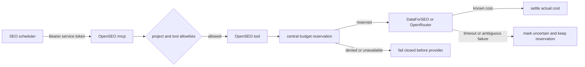

# BTPScale autonomous SEO control plane

This fork adds two hard boundaries around the upstream OpenSEO application.

## Required deployment values

All values belong in the Cloudflare/Alchemy secret or variable store. Never
commit them.

- `SEO_LEDGER_BASE_URL`: the BTPScale control-plane origin.
- `SEO_LEDGER_TOKEN`: bearer credential accepted only by the internal SEO
  budget routes.
- `SEO_PAID_OPERATION_LIMITS_JSON`: reviewed maximum euro-cent cost keyed by
  the exact internal operation name. Missing operations are disabled before
  network dispatch. Keep it `{}` until the current vendor tariff and every
  request-size cap have been reviewed. For OpenRouter, the maximum must cover
  the configured model at 160k input and 16k output tokens.
- `OPENSEO_SERVICE_TOKEN`: bearer credential accepted only by `/mcp`.
- `OPENSEO_SERVICE_EMAIL`: audit identity for the automation user.
- `OPENSEO_SERVICE_PROJECT_IDS`: comma-separated OpenSEO project IDs.
- `OPENSEO_SERVICE_TOOLS`: comma-separated MCP tool names.
- `CF_ACCESS_SERVICE_TOKEN_ID`: ID of a pre-created Cloudflare Access Service
  Token. Alchemy attaches it to a separate application for the exact `/mcp`
  path. The scheduler sends its client ID/secret using
  `CF-Access-Client-Id`/`CF-Access-Client-Secret`, plus
  `OPENSEO_SERVICE_TOKEN` as the normal bearer credential.

Interactive Cloudflare Access still admits only the configured
`ACCESS_ALLOWED_EMAILS`. The Access service policy matches `/mcp` only; the
OpenSEO bearer is then checked by the Worker before any MCP tool is exposed.
The service token does not become a browser session and does not authorize UI
or account routes.

## Budget behavior

Every DataForSEO call made through `createDataforseoClient` reserves from the
`research` category before network dispatch. SAM reserves from `writing`
before **each** OpenRouter model step and before each standalone compaction.
One `openrouter:sam-step` reservation covers one generation, never the whole
40-step turn. One `openrouter:sam-compaction` reservation covers exactly one
summary generation. Reservations use an idempotent operation ID. A timed-out
reservation POST is reconciled once by operation ID and is never replayed
blindly.

SAM bounds every step's serialized messages to 128,000 UTF-8 bytes in addition
to Think's 160,000-token context guard and 16,000-token output cap. The tariff
for `openrouter:sam-step` must cover the configured model at the full
160,000-input/16,000-output token limits, including the fixed system prompt and
skills. Compaction is independently bounded to 128,000 UTF-8 input bytes and
4,000 output tokens.

The reservation amount comes only from `SEO_PAID_OPERATION_LIMITS_JSON`; there
is no permissive default. Known provider cost settles the reservation and
releases the unused amount.
A timeout, connection loss, or ambiguous provider error marks it `uncertain`
and preserves the reservation. A provider response without valid usage-cost
metadata is also uncertain; it is never settled as a zero-cost call. If actual cost exceeds the reservation, the
central ledger records the debt and freezes the category. Concurrent calls may
each hold a reservation; the central ledger enforces their aggregate against
the category balance. No claim is made that only one operation can be in
flight or that a third-party vendor can never report a higher final cost.

DataForSEO automatic 5xx retries are disabled because a failed HTTP response
does not prove that a paid live request was not processed.

## Service authorization

`tools/list` exposes only `OPENSEO_SERVICE_TOOLS`. Every service `tools/call`
must also carry a `projectId` from `OPENSEO_SERVICE_PROJECT_IDS`; `whoami` is
the only projectless discovery call. Existing Cloudflare Access, OAuth and
personal API-key authentication paths are preserved. Paid calls from the UI,
MCP and cron still fail closed when their project or exact paid-operation cost
is not configured.

## Rollback

Before deployment, retain the previously deployed Worker version. Roll back
the Worker first if the new MCP or provider gate breaks normal traffic. The
central ledger reservations are independent records: do not delete or release
`uncertain` entries during rollback; reconcile them against provider usage.

Removing the six control-plane variables disables the service identity and
makes paid calls fail closed. It is a safe emergency stop, not a way to restore
ungated provider access.

## Current deployment gate

Deployment requires all of the following:

1. DataForSEO credentials in the platform vault.
2. Central ledger URL/token and allowlists for the three real OpenSEO project
   IDs.
3. Cloudflare R2 enabled. Alchemy OAuth `access:write` was verified on the
   BTPScale account on 2026-09-20; do not repeat the login during deployment.
4. A reviewed plan/diff, followed by the first deploy with Worker logs open.

No paid provider call is part of validation. Unit tests use mocked ledger and
provider responses.
